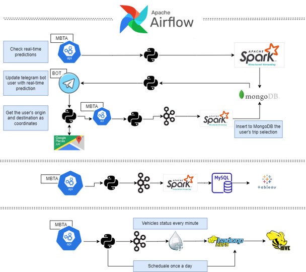

# MBTA Data Engineer Course_Final Project

## This Project was created as the Final Project in the Big Data Engineer course at Naya College By Nitay Yacobovitch, Shoham Gilady and Dor Izmaylov.
We used MBTA API (Massachusetts Bay Transportation Authority) and Google Maps API, and we created data pipelines - while using big data technologies that we learned in the course.

Our main business goals were:
1. Build a trip planner using telegram bot that will allow to the user interact with the API in real-time - and send him notifications and information about the trip, the stations and the schedule
2. Help the passenger to get information on the different alerts (problems or shutdowns with different lines/stops) in real-time
3. Send monthly recap in Slack for managers and stakeholders in the public transporation activity

Our technical/technological goals were:
1. Make a use with the different tools and technologies we covered in the course
2. Develop few procceses with different goals and capabilities, so we can have an experience with wide range of technologies and different types of work]
   - Real-time data proccessing and communicating with a customer via Telegram Bot
   - Real-time data proccessing with limited history, and showing it in a informative dashboard
   - Build an archive that will save all the existing history
  
## Our architecture:
  

